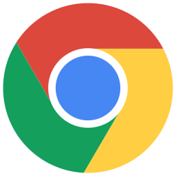
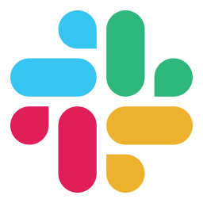
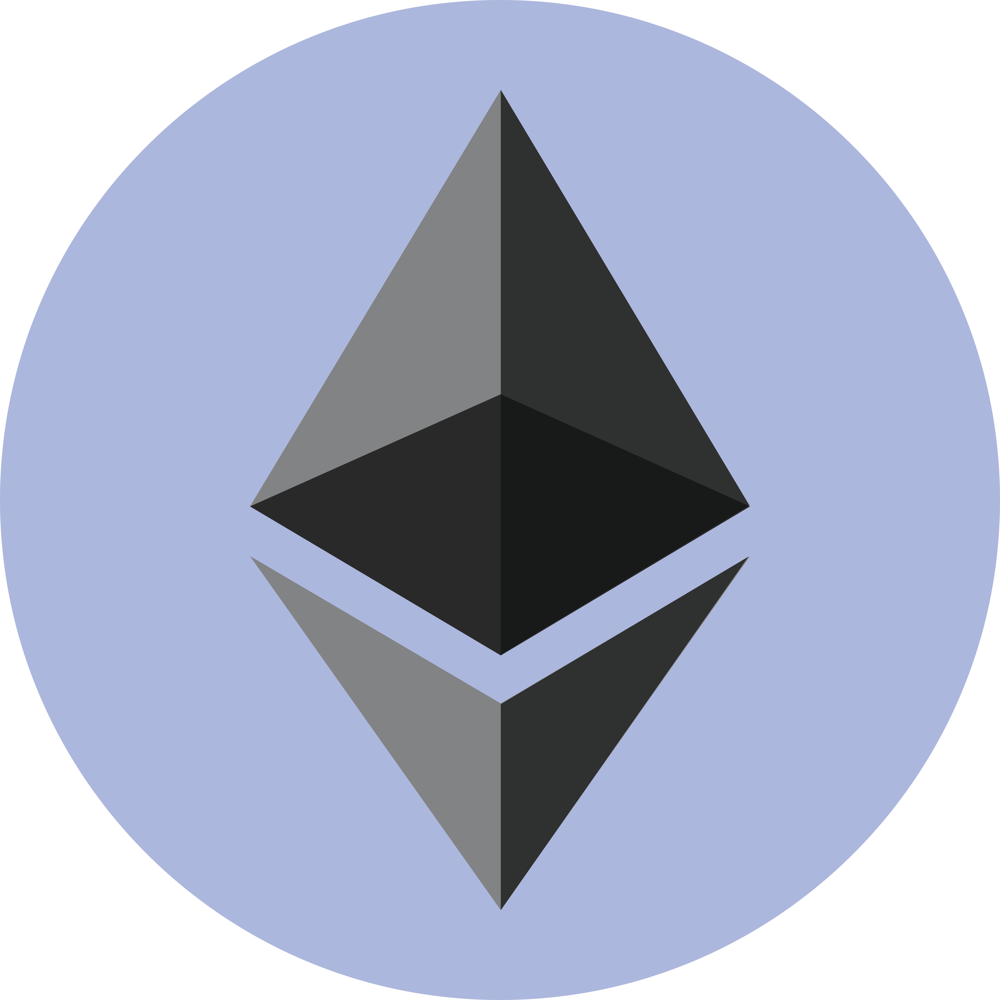
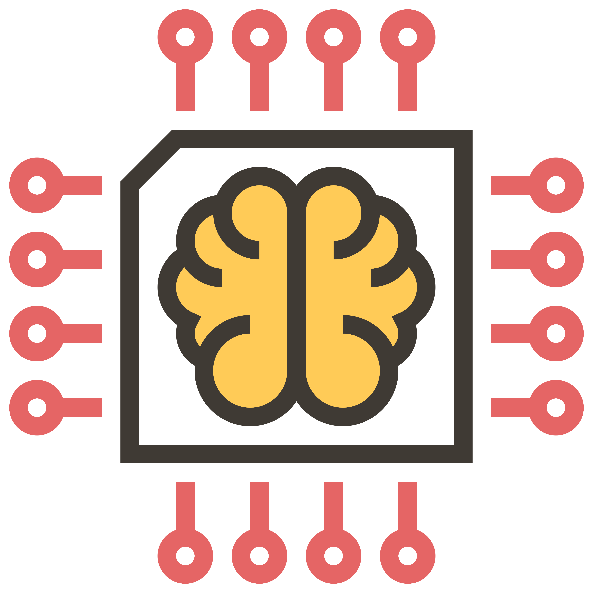

#  👋   Hi, I’m David!

Currently studying software development at CodeFellows. 
My background is in chemistry and nuclear power.

##  Actively Learning

|  |  |  |
| ----------- | ----------- | ----------- |
 |  |  | 
|  |  |  |
|  |  |  |
|  |  |  |

## Tools
| | | |
| ----------- | ----------- | ----------- |
|  MacOS |  Visual Studio Code |  Google Chrome |
|  Git |  Github |  Slack |
| | | |

## Interested in

| | | |
| ----------- | ----------- | ----------- |
|  Blockchain |  AI / ML |  Formula 1 |
| | | |

## Hobbies

    - Rock Climbing
    - Photography
    - Snowboarding
    - Snowshoeing/Mountaineering
    - Espresso

### Connect with me

    [David Hecker](https://www.linkedin.com/in/david-hecker/)

   heckerdw@gmail.com

<!---
heckerdavid/heckerdavid is a ✨ special ✨ repository because its `README.md` (this file) appears on your GitHub profile.
You can click the Preview link to take a look at your changes.
--->
