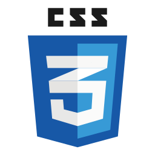
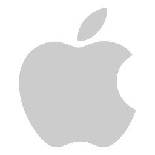
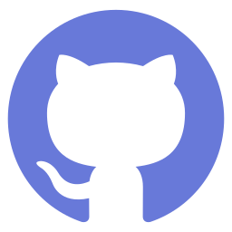

#  👋   Hi, I’m David!

I am a software developer, Navy veteran, and avid learner who thrives in fast paced, high stakes environments. I am passionate about sustainability, increasing access to information globally, and empowering individuals to impact change.
My background is in chemistry, nuclear power, and team leadership.

##  Languages

|  |  |  |  |
| ----------- | ----------- | ----------- | ----------- |
 |  |  |  |
|  |  |  |  |

## Tools
| | | |
| ----------- | ----------- | ----------- |
|  React |  Visual Studio Code |  MacOS |
|  Git |  Github |  Linux |
|  Nodejs |  MongoDB |  Expressjs |
| | | |

## Projects

- [Apple Smash](https://github.com/NotFFTT/game)
  - an online multiplayer battle game which can host up to four unique character players. Apple Smash utilizes the Python Arcade game engine and Digital Ocean for server hosting.
  - [Demo](https://youtu.be/L9-kgbdOjHE)

- [Python Data Structures and Algorithms](https://github.com/heckerdavid/data-structures-and-algorithms/tree/main/python)

## Hobbies / Interests

     Keyboards
     Formula 1
     Rock Climbing
     Photography
     Snowboarding
     Snowshoeing/Mountaineering
     Espresso
     James Webb Space Telescope
     Motorcycles
     House Plants
     Yoga

### Connect with me

  &nbsp;  &nbsp;&nbsp;[David Hecker](https://www.linkedin.com/in/david-hecker/)

  &nbsp;  &nbsp;&nbsp;heckerdw@gmail.com
